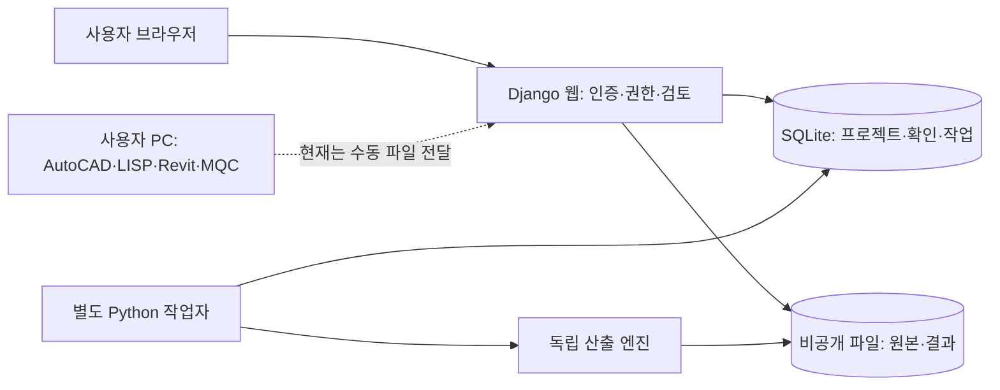

# 구성요소와 실행 환경

## 선택한 구성

Python을 중심으로 Django(웹 요청·사용자 인증·DB), ezdxf(DXF), openpyxl(엑셀)을 사용한다. 화면은 서버에서 HTML을 만들고 CSS로 표시한다. 첫 버전에는 React/Node 빌드나 런타임 AI가 필요하지 않다. 이는 Python 학습자가 서버와 계산을 함께 이해하기 쉬운 구성이다. 더 복잡한 도면 조작이 필요해지면 별도 브라우저 기술을 추가할 수 있다.

## 모듈 경계

| 모듈 | 역할 |
|---|---|
| `config/`, `projects/views.py`, `templates/` | 실제 인증, 프로젝트/파일 권한, 검토 화면 |
| `projects/models.py` | 원본 버전, 사용자 확인 이력, 작업과 입력 스냅샷 |
| `projects/tasks.py`, `runworker` | 작업 인계·실행·실패·결과 보관 |
| `takeoff/engine.py:extract` | CAD 속성과 좌표 추출, 미지원 경고 |
| `validate_decision`, `calculate` | 확정 정보 검증, 단위 변환, 직접 길이 집계 |
| `export`, `compare_baseline` | 별도 DXF/XLSX/JSON, 기존 산출 비교 |
| `rules/` | 계산 기준 예시, 버전과 실행 시 해시 |
| 후속 adapter | MQC·BIM·PC 연결. 아직 실행 코드는 없음 |

## 웹과 긴 작업의 분리

업로드와 실행 요청은 DB에 작업을 등록하고 즉시 응답한다. 작업자는 별도 프로세스로 실행한다. SQLite 개인용 첫 버전은 파일 잠금으로 한 작업자만 허용한다. 원자적인 `queued → running` 변경으로 이중 점유를 막는다. 같은 원본 버전·확인 수정 번호·기준·단위·엔진 버전의 요청은 하나의 작업으로 모인다.

작업 제한 시간은 120초이며 업로드는 10 MB, 모델 공간 객체는 20,000개, 개별 폴리선 정점은 50,000개까지다. 이 제한은 임의 정확도 보증이 아니라 개발 환경 자원 제한이다. 실패는 원인을 보관하고 사용자 POST 요청으로 최대 3번 실행한다. 이전 작업자가 비정상 종료하면 다음 시작에서 남은 running을 실패로 바꾼다. 사용자 확인 정보가 수정된 작업은 새 스냅샷으로 별도 등록한다.

SQLite 작업자의 파일 잠금과 시간 제한은 Linux `fcntl`/`SIGALRM`을 사용한다. 웹/엔진과 달리 작업자는 Windows 직접 실행을 검증하지 않았다. Windows에서 개발할 때는 WSL 또는 별도 Linux 서버를 사용한다. 클라우드의 현재 Python/Linux 실행은 확인되었다. 다중 사용자·다중 작업자는 PostgreSQL + 별도 작업 큐(Celery 등)로 확장하고 작업자 격리와 재시도 정책을 재검증한다.

## 인증·파일 보호와 운영 구분

Django 해시 비밀번호·세션·CSRF를 사용한다. 로그아웃은 POST다. 로그인 실패를 사용자 식별자/접속 IP의 해시 기준으로 DB에 기록하고 15분 내 10회 실패 시 일시 제한한다. 프록시 운영의 실제 IP 전달 정책과 분산 환경 제한은 배포 때 보완한다.

모든 프로젝트·도면·검토·작업·원본·출력 URL에서 소유자 조건을 검사한다. 공개 미디어 URL은 없다. 다운로드 이름은 허용 목록이며 경로가 자료 폴더를 벗어나면 거부한다. PDF/이미지에는 보호된 응답을 사용한다. 원본은 확장자/용량 및 참고 파일 서명을 검사하고 DXF 파싱 실패는 작업 실패로 남긴다. 공개 업로드 운영을 위한 악성 파일 검사·분리 컨테이너는 아직 없다.

DB와 파일은 실제 디스크에 지속 저장되지만 클라우드 작업 종료/삭제의 플랫폼 보존 정책까지 보장하지 않는다. 환경 게시 스냅샷과 사용자 자료의 정기 백업은 서로 다르다. 운영 시 DB+원본+결과를 같은 시점 기준으로 백업하고 복구를 시험해야 한다. 장기 운영은 관리형 DB와 비공개 객체 저장소를 권장한다.

## PC/CAD/MQC/BIM 확장

AutoCAD·Revit·MQC는 사용자 PC의 프로그램이다. Linux 웹 서버에서 바로 실행할 수 있다고 가정하지 않는다. 처음에는 AutoCAD에서 별도 DXF로 저장해 수동 전달한다. 후속 PC 연결 프로그램은 인증된 작업을 가져와 허용한 로컬 소프트웨어만 실행하고 결과·버전·오류를 돌려주는 방식으로 검토한다. 임의 셸 명령을 실행하는 연결은 만들지 않는다.

BIM 전에는 Revit 편집용 모델과 IFC 교환용 모델의 목적을 결정한다. 높이·층고·구배·연결·부속·패밀리의 근거가 있어야 한다. 단순 XY 경로의 3D 시각화와 속성·연결을 가진 BIM 객체는 별개다. 평면 교차를 연결로 확정하지 않는다.

Codex 개발 지원과 제품의 런타임 AI는 별개다. 현재 API 키·AI 요금·외부 도면 전송은 없다. AI 추가 시 공급자 API/인증/요금/보존·국외 전송/사용자 승인·근거와 검증 데이터셋을 별도 결정한다.
